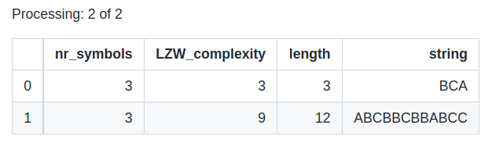
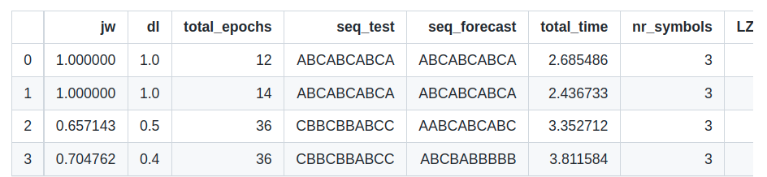

Symbolic sequence prediction with machine learning
=====================================================

Machine learning with symbols
------------------------------

Given a sequence of symbols, ask you to predict the following symbols, what will you do with machine learning? An intuitive way is to transform the symbols to numerical labels, 
decide the appropriate windows size for features input (lag), and then define a classification problem. slearn build a pipeline for this process, and provide user-friendly API.

First import the package:

.. code:: python

    from slearn import symbolicML

We can predict any symbolic sequence by choosing the classifiers available in scikit-learn. Currently slearn supports:

+----------------------------------+----------------------------------+
|             Classifiers          |         Parameter call           |
+==================================+==================================+
|Multi-layer Perceptron            |'MLPClassifier'                   |
+----------------------------------+----------------------------------+
|K-Nearest Neighbors               |'KNeighborsClassifier'            |       
+----------------------------------+----------------------------------+
|Gaussian Naive Bayes              |'GaussianNB'                      |
+----------------------------------+----------------------------------+
|Decision Tree                 	   |'DecisionTreeClassifier'          |
+----------------------------------+----------------------------------+
|Support Vector Classification	   |'SVC'                             |
+----------------------------------+----------------------------------+
|Radial-basis Function Kernel	   |'RBF'                             |
+----------------------------------+----------------------------------+
|Logistic Regression	           |'LogisticRegression'              |
+----------------------------------+----------------------------------+
|Quadratic Discriminant Analysis   |'QuadraticDiscriminantAnalysis'   |
+----------------------------------+----------------------------------+
|AdaBoost classifier	           |'AdaBoostClassifier'              |
+----------------------------------+----------------------------------+
|Random Forest        	           |'RandomForestClassifier'          |
+----------------------------------+----------------------------------+
|LightGBM                          |'LGBM'                            |
+----------------------------------+----------------------------------+

Now we predict a simple synthetic symbolic sequence

.. code:: python

    string = 'aaaabbbccd'

First, we define the classifier, and specify the ``ws`` (windows size or lag) and ``classifier_name`` following the above table, initialize with

.. code:: python

    sbml = symbolicML(classifier_name="MLPClassifier", ws=3, random_seed=0, verbose=0)

Then we can use the method ``encode`` to split the features and target for training models. The we use method ``forecast`` to apply forecasting:

.. code:: python

    pred = sbml.forecast(x, y, step=5, hidden_layer_sizes=(10,10), learning_rate_init=0.1)

The parameters of ``x``, ``y``, and ``step`` are fixed, the rest of parameters are depend on what classifier you specify, the parameter settings can be referred to scikit-learn library.
For nerual network, you can define the parameters of ``hidden_layer_sizes`` and ``learning_rate_init``, while for support vector machine you might define ``C``.

Generating symbols
------------------------------

slearn library also contains functions for the generation of strings of tunable complexity using the LZW compressing method as base to approximate Kolmogorov complexity.

.. code:: python

    from slearn import *
    df_strings = LZWStringLibrary(symbols=3, complexity=[3, 9])
    df_strings

Also, you can deploy RNN test on the symbols you generate:

.. code:: python

    df_iters = pd.DataFrame()
    for i, string in enumerate(df_strings['string']):
        kwargs = df_strings.iloc[i,:-1].to_dict()
        seed_string = df_strings.iloc[i,-1]
        df_iter = RNN_Iteration(seed_string, iterations=2, architecture='LSTM', **kwargs)
        df_iter.loc[:, kwargs.keys()] = kwargs.values()
        df_iters = df_iters.append(df_iter)
    df_iter.reset_index(drop=True, inplace=True)
    df_iters.reset_index(drop=True, inplace=True)
    print(df_iters)

