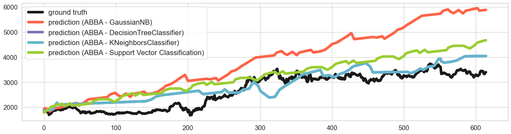

## Summary

Symbolic representations of time series have proved their usefulness in the field of time series motif discovery [@10.1007/s10618-007-0064-z}, clustering [@10.1007/s10618-007-0064-z], classification [@Schfer2014TheBI], forecasting [@EG20b], anomaly detection [@10.1145/775047.775128], etc. Transforming time series into symbolic representation reduces the dimensionality of time series by compressing time series while preserving its underlying structure, and therefore speedups the downstream time series task. With the meaningful patterns underlying informative symbols, a compressed sequence can greatly speed up the algorithm inference time in prediction. Appropriately employing machine learning algorithms on the level of symbols instead of raw time series poses a great challenge to symbolic time series forecasting problems. For the convenience of the research community on studying the symbolic representation, we design a Python module for benchmarking the process of machine learning algorithm practice with symbolic representation, called `slearn`.  Our software includes some basic symbols preprocessing tools and builds a baseline for various machine learning models through scikit-learn package [@scikit-learn] for symbolic prediction. Our library mainly concerns two components, namely string generator, machine learning forecasting. The string generator and compression follow the new research paper [@CCG21} while the forecasting follows the [@EG20b]. 

## Examples of use

`slearn` is publicly available on GitHub and can be installed via the pip package manager. The documentation in \url{https://slearn.readthedocs.io/en/latest/?badge=latest} provides detailed functionality guidance and deployment of prediction with SAX [@10.1145/882082.882086], ABBA [@EG19b], and fABBA [@CG22a]. slean module offers user-friendly APIs, and consistent parameters for prediction as scikit-learn package. The forecasting empirical result of `slearn` prediction for amazon stock close price is as shown in \autoref{fig:demo}.

## Statement of need

Currently, there is no software that leverages the symbolic time series representation techniques with a combination of machine learning algorithms for prediction. For the convenience of the machine learning community of developing algorithms on the level of symbolic representation, we develop these tools for benchmark test of symbolic time-series representation and also for practical forecasting use. It can generate large-scale time series data according to the need of the user by specifying the Lempel–Ziv–Welch compression (LZW) [@Welch1984] for symbolic sequences, which allows researchers to develop their machine learning algorithm in this test benchmark. Besides, slean offers fundamental string processing tools including one-hot encoding and LZW compression. For the purpose of easy-to-use, the software keeps consistent and simple APIs for employment. New functionality will be added in the future.

## Acknowledgements

Roberto Cahuantzi's work has been funded by the UK's Alan Turing Institute. Stefan Güttel has been supported by a Fellowship of the Alan Turing Institute, EPSRC grant EP/N510129/1.

## References
